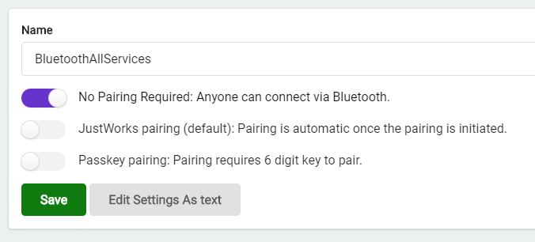

# Bluetooth LE with nodejs on Raspberry PI - Talking to a BBC micro:bit

Tested on a Raspberry PI 3B with Rasbian Stretch Lite and RaspiOS Lite

This is just an experiment, not a full fledged library.


## Installing BLUEZ

Install Prerequisites:

```
sudo apt-get install libusb-dev libdbus-1-dev libglib2.0-dev libudev-dev
sudo apt-get install libical-dev
sudo apt-get install libreadline-dev
```

Download Bluez: http://www.bluez.org/download/

```
wget http://www.kernel.org/pub/linux/bluetooth/bluez-5.54.tar.xz
tar -xvf bluez-5.54.tar.xz
cd bluez-5.54
```

Compile and install:

```
sudo ./configure        (--disable-systemd) ???
sudo make
sudo make install
```

You may now remove the folder bluez-5.54 and the .xz file if you wish.

Reboot the Pi.

Edit: /lib/systemd/system/bluetooth.service

```
sudo nano /lib/systemd/system/bluetooth.service
```

Add "--experimental" to the 'ExecStart' line:

```
ExecStart=/usr/local/libexec/bluetooth/bluetoothd --experimental
```

```
systemctl start bluetooth
systemctl status bluetooth
```

This should show 'active (running)'.


## Nodejs app with NOBLE

### Step 1

- First Install BLUEZ (see above)

### Step 2

- Clone this repo - git clone https://github.com/DeShrike/MicroBLE.git

### Step 3

- Run: npm init

	This will install noble and @abandonware/bluetooth-hci-socket

	Ignore the errors during the building of bluetooth-hci-socket

### Step 4

- Edit line 6 of node_modules/noble/lib/hci-socket/hci.js like this:

```
var BluetoothHciSocket = require('@abandonware/bluetooth-hci-socket');
```

To make your own app:

```
npm init -y
npm install noble --save
npm install @abandonware/bluetooth-hci-socket --save
```

And then edit node_modules/noble/lib/hci-socket/hci.js


### Step 5 - Preparing your Micro:bit

#### Option 1

Install MicroBLE.hex on your micro:bit.

You can also try one of the other .hex files. More info about those here:

- https://www.bluetooth.com/blog/bluetooth-bbc-microbit/
- https://github.com/lancaster-university/microbit-samples/tree/master/source/examples/bluetooth-services
- https://lancaster-university.github.io/microbit-docs/ble/profile/

After the micro:bit reboots, you should see this pattern:


#### Option 2 - Create your own .hex file

Go to https://makecode.microbit.org and create a new project.

Install the bluetooth services.


Create the app. Mine looks like this:


Make sure to select 'No pairing required' in the project settings.



Upload it to the micro:bit.

**Beware**

The micro:bit has very little memory. Adding all 6 BLE services to your app results in a memory error. 
If the micro:bit shows a sad face and then the number 020, it means your program is too large.

### Step 6

```
sudo node scan.js
```

This will scan for Bluetooth LE devices and exit if it finds a micro:bit.

```
sudo node temperature.js
```

This will scan for Bluetooth LE devices and connect to the first micro:bit it finds and read the temperature.


```
sudo node fulltest.js
```

This script will connect to the first micro:bit it finds and send some commands to it:
- Read temperature
- Read the state of the 2 buttons
- Show a few patterns on the LED matrix
- Toggle PINs 0, 1 and 2 low/high a few times
- Wait for a few button presses


## References

- https://www.youtube.com/watch?v=AFjYKEf7j2M
- https://www.youtube.com/watch?v=sP0MjQDv2N4
- http://www.bluez.org/download/
- https://github.com/noble/node-bluetooth-hci-socket/issues/107
- https://github.com/noble/noble


## To run without sudo:

```
sudo setcap cap_net_raw+eip $(eval readlink -f `which node`)
```

## Using bluetoothctl

You can use this tool to browse the BLE services of a device.

```
sudo bluetoothctl

power on
scan on
scan off
devices
connect DD:82:10:FF:52:5E               <- add the address of your device here
menu gatt
select-attribute /org/bluez/hci0/dev_DD_82_10_FF_52_5E/service0013       <- sample
attribute-info
back
disconnect
power off
exit
```

## TODO

Reading of the Accelerometer and Magnetometer is not implemented (yet).

server.js is a WIP

